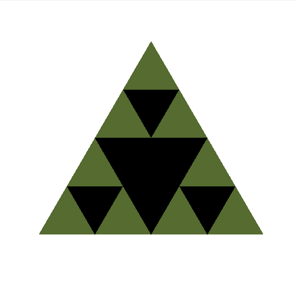
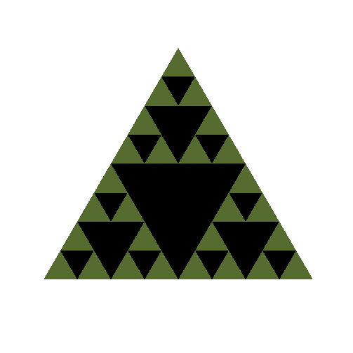
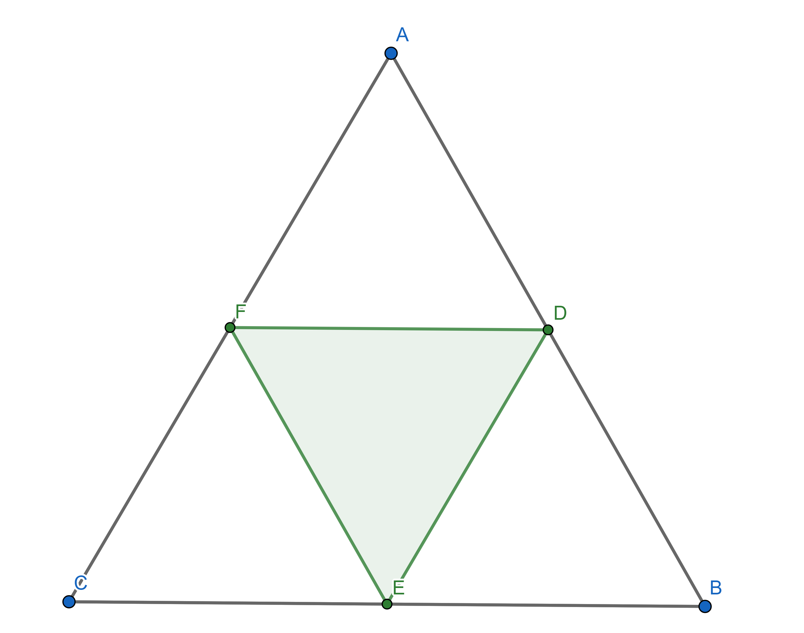
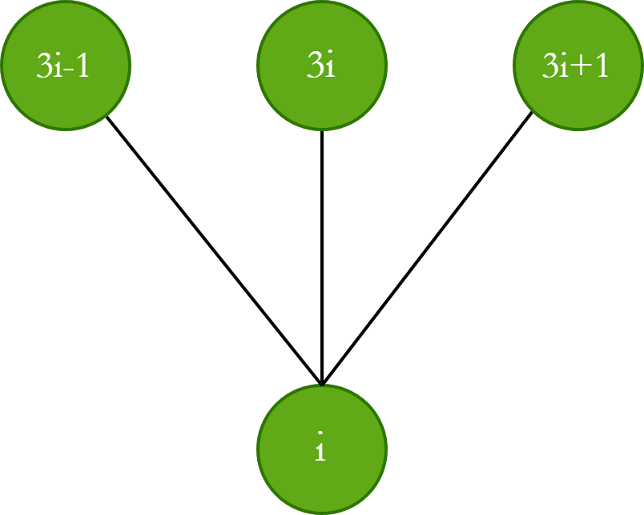
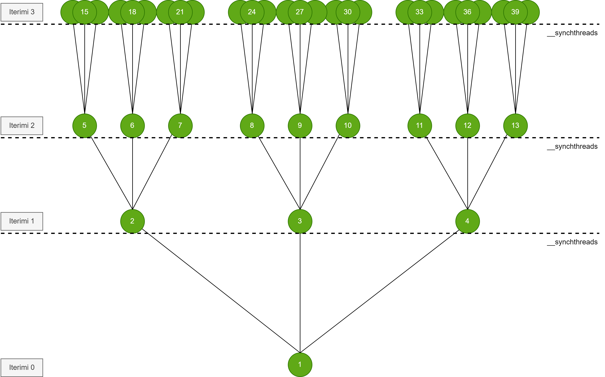
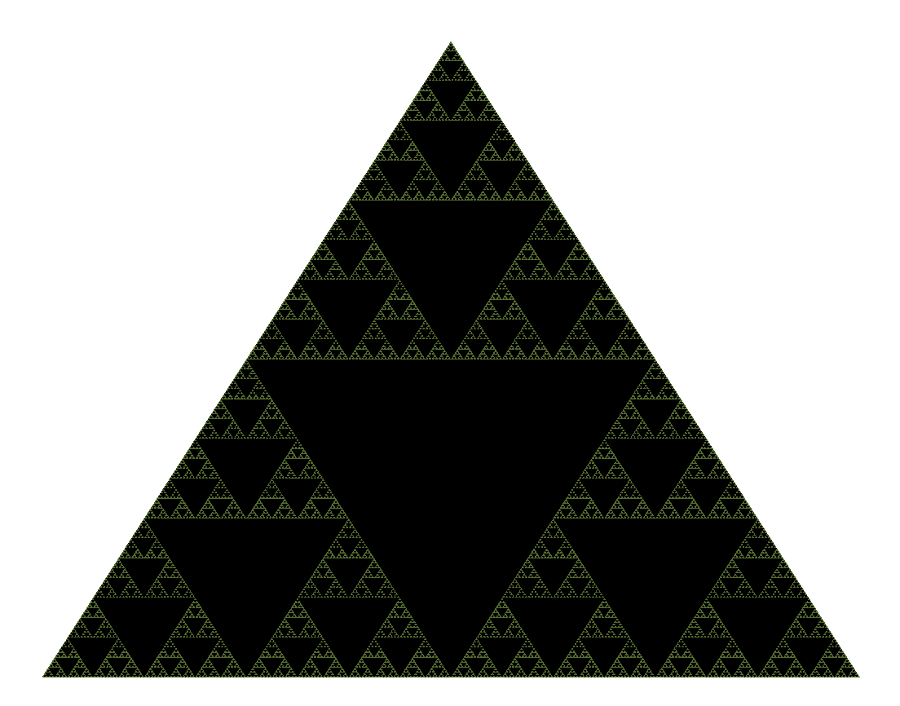

# Parallel-Sierpinski-Triangle
 GPU-accelerated Sierpinski Triangle generation with CUDA and OpenGL interoperability.


# Sierpinski Triangle


The Sierpinski Triangle is a famous fractal named after the mathematician Waclaw Sierpinski. The fractal can be constructed by starting with an equilateral triangle and then recursively dividing each triangle as follows:

1. On each side of the triangle, find the midpoint and connect these points, forming four new triangles.

2. Repeat the process in each triangle except the middle triangle.


<div>
  <p>
    
    
    
    
  </p>
</div>

## Construction of the inner triangle 

Let the triangle $\triangle ABC$ be given and the points $D, E, F$
that bisect the edges of the triangle. The coordinates of the points $D, E, F$
are:

<p>
   
</p>


$$D = \left( \frac{a_1 + b_1}{2}, \frac{a_2 + b_2}{2} \right)$$

$$E = \left( \frac{b_1 + c_1}{2}, \frac{b_2 + c_2}{2} \right)$$

$$F = \left( \frac{a_1 + c_1}{2}, \frac{a_2 + c_2}{2} \right)$$


Triangles $\triangle ADF$, $\triangle DBE$, $\triangle FEC$, will enter the next iteration for division.

## Number of vertices.

In the visualization of the fractal, the initial triangle will be rendered in green, and the inner triangles will be rendered in black. It is necessary to find the number of points of the inner (black) triangles.
Let $T(n)$ denote the number of triangles added from iteration $n-1$ to $n$. Thus, $T(1) = 1$,
$T(2) = 3$, $T(3) = 9$. Each triangle, after division, gives 3 new triangles in which the black triangles will be constructed.

$$T(n) = 3T(n-1) = 3^2 T(n-2) = \cdots = 3^{n-1} T(1) = 3^{n-1}$$

\
The number of all black triangles in iteration $n$ is the sum:

$$T(1) + T(2) + \cdots + T(n) = 3^0 + 3^1 + \cdots + 3^n = \sum_{i=0}^{n-1} 3^i = \frac{3^n - 1}{2}$$

Each triangle has three points, and if we also calculate the three points of the initiatl triangle we have:

$$f(n) = 3 + \frac{3 \cdot (3^n - 1)}{2} = 3 + \frac{3^{n+1} - 3}{2} = \frac{3}{2} (3^n + 1)$$

The sequence $f(n)$ gives the number of total points of the inner triangles(black triangles) and of the initial triangle in iteration $n$. First we have rendered the initial triangle in green, 
(line 6), and then the black triangles (line 10).

```
    void renderTriangleFromBuffer() {
     glVertexAttribPointer(0, 2, GL_FLOAT, GL_FALSE, 0, nullptr);
     glEnableVertexAttribArray(0);
     //Render first green triangle
     glColor3f(0.29f, 0.44f, 0.55f);
     glDrawArrays(GL_TRIANGLES, 0, 3);
     //Render blackTriangles
     int numberVerticesBlackTriangles = (pow(3, iterations + 1) - 3) / 2;
     glColor3f(0.0f, 0.0f, 0.0f);
     glDrawArrays(GL_TRIANGLES, 3, numberVerticesBlackTriangles);
     glutSwapBuffers();
    } 
```

## Paralelizimi

Parallelization occurs hierarchically, where a certain number of threads are active in each iteration. Each active thread takes the  $i$-th triangle of the figure and finds the three points for constructing the inner triangle. 
The three triangles that will be divided in the next iteration are defined by each thread and inserted into the array of all triangles. The size of this array will be the number of points of the triangles founded previously, divided by 3, because each triangle has three points.

$$\frac{f(n)}{3} = \frac{1}{2} (3^n + 1)$$

\

In each iteration, there will be $3^n$ active threads. As the iterations increase, the number of active threads will increase exponentially:

- Iteration 0: Only the thread with id 0 will be active. This thread initializes the initial triangle.

- Iteration 1: Only the thread with id 1 is active. This thread constructs the first inner triangle. The three triangles are defined and inserted into the array of triangles at positions 2, 3, and 4, which will be divided in the next iteration.

- Iteration 2: Threads 2, 3, and 4 are active. Each thread takes the corresponding triangle based on their index. Each thread constructs the inner triangle, defines 3 triangles, which are inserted into the array of all triangles.

- Iteration $n$: Threads $$\frac{3^n + 1}{2}$$ to $$\frac{3^{n+1} - 1}{2}$$ will be active. These threads take the triangles from the previous iteration and construct the inner triangles in them.]

<p>
   
</p>


<p>
   
</p>

Parallelization and data addition are modeled in a ternary graph. Each node in the ternary graph represents a thread that constructs the inner triangles, while the branches represent the division of three triangles in future iterations. 
Each thread $i$ takes triangle $i$ from the array of triangles, divides it, and adds three new triangles in the child positions $3i-1$, $3i$, and $3i+1$. Each level of the graph represents the threads that are working in parallel.

\
The leftmost index at the level n of the graph is:

$$\text{rightMost}(n) = \sum_{i=0}^n 3^i = \frac{3^{n+1} - 1}{2}$$

The rightmost index at the level n of the graph is:

$$\text{leftMost}(n) = \text{rightMost}(n-1) + 1 = \frac{3^n - 1}{2} + 1 = \frac{3^n + 1}{2}$$

Number of of threads working in parallel at level $n$ is:

$$\text{leftMost}(n+1) - \text{leftMost}(n) = \frac{3^{n+1} + 1}{2} - \frac{3^n + 1}{2} = 3^n$$

## Kerneli

The following kernel generates the fractal through parallel computation. Initially, the thread with index 0 handles the initializing triangle. For each iteration, threads between the start_at and end_at intervals are active and calculate the midpoints of the triangle's segments. 
Three new triangles are defined and stored in the array of triangles to be divided. The midpoints of the edges are added to the points array for visualizing the triangle. Synchronization ensures that all threads complete their tasks before proceeding to the next iteration.

```
    __global__ void kernel(float* points, Triangle* triangles, int start_iteration, int max_iteration, int threadShiftIndex) {
        int idx = threadIdx.x + blockDim.x * blockIdx.x;
        idx += threadShiftIndex;
        Point A,B,C,A1,B1,C1;
        Triangle triangle,t_1,t_2t_3;
        auto g = cg::this_grid();
        if (idx == 0) {
        triangles[1] = triangle;
        }
        
        for (int iteration = start_iteration; iteration <= max_iteration; iteration++) {
            int start_at = (round((pow(3, iteration) + 1))) / 2;
            int end_at = (round((pow(3, iteration+1) - 1))) / 2;
            if (idx >= start_at && idx <= end_at) {
                triangle = triangles[idx];
                A = triangle.A;
                B = triangle.B;
                C = triangle.C;
                //DivideTriangle 
                A1.x = (A.x + B.x) / 2.0f;
                A1.y = (A.y + B.y) / 2.0f;
                B1.x = (B.x + C.x) / 2.0f;
                B1.y = (B.y + C.y) / 2.0f;
                C1.x = (C.x + A.x) / 2.0f;
                C1.y = (C.y + A.y) / 2.0f;
                //Make three new Triangles
                t_1.A = A;
                t_1.B = A1;
                t_1.C = C1;
                
                t_2.A = A1;
                t_2.B = B;
                t_2.C = B1;
                
                t_3.A = C1;
                t_3.B = B1;
                t_3.C = C;
                //Insert three new triangles to triangles array
                triangles[3 * idx - 1] = t_1;
                triangles[3 * idx] = t_2;
                triangles[3 * idx + 1] = t_3;
                
                //Add three points 
                int offset = 2 * 3 * (idx);
                points[offset] = A1.x;
                points[offset + 1] = A1.y;
                points[offset + 2] = B1.x;
                points[offset + 3] = B1.y;
                points[offset + 4] = C1.x;
                points[offset + 5] = C1.y;
            }
            g.sync();
        }
    }

```

## Comparisions

The table below compares the execution time in microseconds of the fractal between the sequential version and the parallel version. The CUDA implementation was done using cooperative groups, with 25600 threads per kernel call. 


| Iteration | C++    | CUDA    |
|-----------|--------|---------|
| 0         | 1      | 32      |
| 1         | 2      | 23      |
| 2         | 3      | 23      |
| 3         | 3      | 31      |
| 4         | 5      | 20      |
| 5         | 19     | 23      |
| 6         | 47     | 19      |
| 7         | 133    | 23      |
| 8         | 257    | 22      |
| 9         | 861    | 37      |
| 10        | 2633   | 34      |
| 11        | 8374   | 82      |
| 12        | 30457  | 243     |
| 13        | 74373  | 653     |
| 14        | 271835 | 1886    |
| 15        | 1060085| 6367    |
| 16        | 5812052| 2782181 |
| 17        | 14557977| 6679207 |

*Table: Performance Comparison.*


<p>
   
</p>

